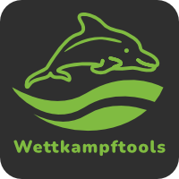

<!-- PROJECT LOGO -->
 

  
   
   

# Wettkampftools
Programm zur vereinfachung der Auswertung beim
DLRG Ortsgruppe Dorheim e.V. Wellenwettkampf und anderen Wettkämpfen in Bad Nauheim.

# [aktuelle Version herunterladen](https://github.com/joe2824/wettkampftools/releases/latest/download/Wettkampftools.zip)

<!-- ROADMAP -->
### Roadmap
- [x] Gesamtauswertung
- [x] Urkunden Druck vereinfachen durch vorsortieren der Urkunden
- [x] Wettkampf Vorbereitung vereinfachen
  - [x] Alle Altersklassen ab AK 13/14 für Welle auswählbar machen
  - [x] Mannschaften vorauswählen je nach Altersklasse
  - [x] Mannschaftsnamen normieren nach Ortsgruppe und Anzahl der Mannschaften

<!-- Lizenz -->
## Lizenz
Veröffentlich unter MIT Lizenz. Siehe `LICENSE.txt` für mehr Informationen.

[Python]: https://img.shields.io/badge/python-000000?style=for-the-badge&logo=python&logoColor=white
